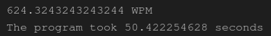
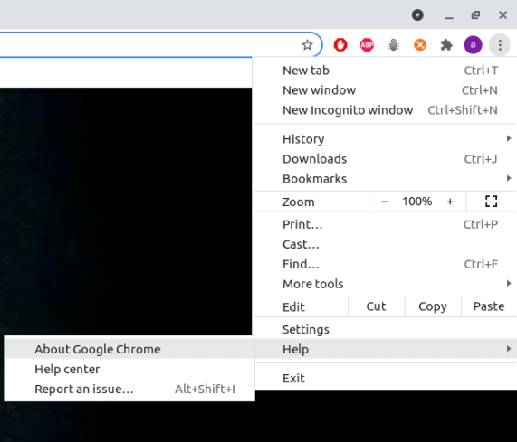
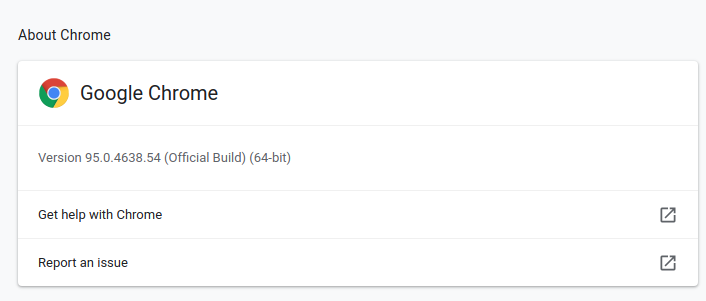

# Automating 10fastfingers with Puppeteer and Selenium

This program aims at comparing two automation libraries, [Puppeteer](https://pptr.dev/) and [Selenium](https://www.selenium.dev/). The criteria will be the time needed to launch a browser and automate the [10fastfingers](https://10fastfingers.com/) typing test.

If you want more explanation about the code check the following blog.

## Using the puppeteer code

This program uses (precisely the [puppeteer-core](https://www.npmjs.com/package/puppeteer-core) library), this is how you run the code:

1. Navigate to the `puppeteer` directory
2. Run `npm install`
3. Change the line 6 in index.js to (`executablePath: "path/to/chrome"`), if you're using Ubuntu, it should work without changing anything
4. Run `node index.js`

A browser will be launched, and the test will be done automatically by puppeteer.

The console will print the speed of typing in words per minute, and the total execution time of the program will also be printed.

## Using the Selenium code

First, navigate to the `selenium` directory.

Install the needed Python modules from the `requirements.txt` file using the following command:

`pip install -r requirements.txt`

In order to be able to run Selenium, you have to install a web driver compatible with your browser.

The program is built to run with Chrome, so install the latest web driver [Chrome web driver](https://sites.google.com/chromium.org/driver/) compatible with your Chrome version.

To check your browser's version, go to "Help -> About Google Chrome"

The version is 95

After installing the driver and exporting it, you need the path to where it is located, this path needs to be in the code.

You have to copy the path and CHANGE THE CODE at line eleven to

`PATH = "yourpath"`

> If you don't follow these instructions the code will not run!

Finally, launch the application using `python main.py`

## License

Copyright &copy; 2021 Ahmad Hamze

Permission is hereby granted, free of charge, to any person obtaining a copy of this software and associated documentation files (the "Software"), to deal in the Software without restriction, including without limitation the rights to use, copy, modify, merge, publish, distribute, sublicense, and/or sell copies of the Software, and to permit persons to whom the Software is furnished to do so, subject to the following conditions:

The above copyright notice and this permission notice shall be included in all copies or substantial portions of the Software.

THE SOFTWARE IS PROVIDED "AS IS", WITHOUT WARRANTY OF ANY KIND, EXPRESS OR IMPLIED, INCLUDING BUT NOT LIMITED TO THE WARRANTIES OF MERCHANTABILITY, FITNESS FOR A PARTICULAR PURPOSE AND NONINFRINGEMENT. IN NO EVENT SHALL THE AUTHORS OR COPYRIGHT HOLDERS BE LIABLE FOR ANY CLAIM, DAMAGES OR OTHER LIABILITY, WHETHER IN AN ACTION OF CONTRACT, TORT OR OTHERWISE, ARISING FROM, OUT OF OR IN CONNECTION WITH THE SOFTWARE OR THE USE OR OTHER DEALINGS IN THE SOFTWARE.
